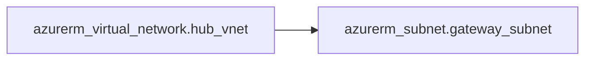

# Quick Start Guide - Enhanced Features

This guide covers the new features and improvements added to the terraform-migration-scripts toolkit.

## Table of Contents

1. [Setup](#setup)
2. [Configuration Management](#configuration-management)
3. [Artifactory Integration](#artifactory-integration)
4. [Validation Tools](#validation-tools)
5. [Cross-Platform Support](#cross-platform-support)
6. [Helper Scripts](#helper-scripts)

---

## Setup

### Install Dependencies

```bash
# Required for full functionality
pip install pyyaml requests

# Optional: for graph rendering
pip install graphviz

# Or install all at once
pip install pyyaml requests graphviz --break-system-packages
```

### Configure Your Environment

```bash
# Copy the configuration template
cp config.yaml config.local.yaml

# Edit with your settings
nano config.local.yaml

# Set environment variable (optional)
export TF_MIGRATION_CONFIG=config.local.yaml
```

---

## Configuration Management

### Using config.yaml

The toolkit now supports centralized configuration via [config.yaml](config.yaml):

**Key Settings:**

```yaml
# Provider versions
terraform:
  providers:
    azurerm:
      version: "~> 4.0"  # Consistent version across all scripts

# Backend configuration
backend:
  resource_group_name: "tfstate-rg"
  storage_account_name: "your-storage-account"
  container_name: "tfstate"
  environment: "public"  # or "usgovernment"
```

**Benefits:**
- Single source of truth for all settings
- No more hardcoded values in scripts
- Environment-specific configurations
- Automatic validation

### Programmatic Access

```python
from config_loader import get_config, get_backend_config, get_provider_version

# Get full config
config = get_config()

# Get backend settings
backend = get_backend_config()

# Get specific provider version
azurerm_version = get_provider_version('azurerm')
```

### Validate Configuration

```bash
python config_loader.py
```

Output:
```
============================================================
TERRAFORM MIGRATION CONFIGURATION
============================================================

Terraform Version: >= 1.5.0

Providers:
  - azurerm: hashicorp/azurerm @ ~> 4.0
  - artifactory: jfrog/artifactory @ ~> 10.0

Backend Configuration:
  Resource Group: tfstate-rg
  Storage Account: tfstatemigrate3199
  Container: tfstate
  Environment: public

============================================================
✓ Configuration is valid
```

---

## Artifactory Integration

### Setup Artifactory Provider

1. **Set credentials:**

```bash
export ARTIFACTORY_ACCESS_TOKEN="your-token-here"
export ARTIFACTORY_URL="https://artifactory.example.com"
```

2. **Configure in config.yaml:**

```yaml
artifactory:
  url: "https://artifactory.example.com"
  backend:
    repo: "terraform-state-generic"
    subpath: "artifactory"
```

### Discover Artifactory Resources

```bash
# Discover and display
python artifactory_helper.py discover --url https://artifactory.example.com

# Save inventory
python artifactory_helper.py discover --url https://artifactory.example.com -o inventory.json
```

### Generate Terraform Configuration

```bash
# Generate configuration for all repositories
python artifactory_helper.py generate --url https://artifactory.example.com -o artifactory_repos.tf
```

Output example:
```hcl
resource "artifactory_local_repository" "docker_local" {
  key          = "docker-local"
  package_type = "docker"
  description  = "Docker local repository"
}
```

### Validate Connection

```bash
python artifactory_helper.py validate
```

### Use Artifactory Provider

Copy the template and customize:

```bash
cp providers-artifactory.tf your-project/providers-artifactory.tf
# Edit with your Artifactory URL
```

---

## Validation Tools

### Validate Migration State

The [validate_migration.py](validate_migration.py) script checks:
- Required files exist
- Terraform is initialized
- Provider versions are correct
- Outputs are present in state
- No drift detected (optional)
- Catalog structure is valid

**Basic Validation:**

```bash
python validate_migration.py --subscription sub-prod-core
```

**Check for Drift:**

```bash
python validate_migration.py --subscription sub-prod-core --check-drift
```

**Validate Catalog Only:**

```bash
python validate_migration.py --subscription sub-prod-core --catalog-only
```

**Example Output:**

```
============================================================
TERRAFORM MIGRATION VALIDATION
============================================================
✓ Configuration valid

ℹ Validating: rg-networking
  ✓ Terraform initialized
  ✓ Provider version: 4.11.0
  ✓ Found 5 output types

ℹ Validating: rg-compute
  ✓ Terraform initialized
  ✓ Provider version: 4.11.0
  ✓ Found 8 output types

ℹ Validating Catalog
  ✓ Catalog structure valid
  ✓ vnets: 3 resources
  ✓ subnets: 12 resources
  ✓ linux_vms: 5 resources
  ✓ Total resources in catalog: 45

============================================================
✓ All validations passed!
============================================================
```

---

## Cross-Platform Support

### Batch Export on Linux/macOS

Previously only [batch_export.bat](batch_export.bat) existed for Windows. Now [batch_export.sh](batch_export.sh) provides the same functionality for Unix systems.

**Setup:**

```bash
# Make executable
chmod +x batch_export.sh

# Edit RESOURCE_GROUPS array
nano batch_export.sh
```

**Usage:**

```bash
# Standard export
./batch_export.sh your-subscription-id

# Azure Government
./batch_export.sh your-subscription-id --gov
```

**Features:**
- Colored output (✓ success, ✗ errors, ⚠ warnings)
- Progress tracking
- Summary statistics
- Rate limiting
- Error handling

---

## Helper Scripts

### Dependency Graph Generator

Visualize resource dependencies in your Terraform configurations.

**Generate DOT graph:**

```bash
python dependency_graph.py --rg legacy-import/sub-prod/rg-network -o graph.dot
```

**Generate Mermaid diagram:**

```bash
python dependency_graph.py --rg legacy-import/sub-prod/rg-network --format mermaid
```

**Generate text tree:**

```bash
python dependency_graph.py --rg legacy-import/sub-prod/rg-network --format text
```

**Render to image:**

```bash
# Requires: pip install graphviz
python dependency_graph.py --rg legacy-import/sub-prod/rg-network --render
```

**Example Text Output:**

```
Terraform Resource Dependencies:

└── azurerm_virtual_network.hub_vnet
    ├── azurerm_subnet.gateway_subnet
    │   └── azurerm_virtual_network_gateway.vpn_gw
    └── azurerm_subnet.app_subnet
        ├── azurerm_network_security_group.app_nsg
        └── azurerm_linux_virtual_machine.app_vm
```

**Mermaid Output:**



---

## Common Workflows

### Azure Discovery with Path Selection

```bash
# Interactive path selection (recommended)
python az_discover.py --create-structure

# Output:
# Choose base path for folder structure:
#   1. ./terraform (relative to current directory)
#   2. ./legacy-import (relative to current directory)
#   3. Enter custom path
#
# Enter choice [1-3] (default: 1): 2

# Or specify path directly
python az_discover.py --create-structure --base-path /path/to/your/project

# With subscription filter
python az_discover.py --create-structure --subscription-filter "prod-*"

# Include resource counts (slower)
python az_discover.py --create-structure --include-resources
```

### Complete Migration Validation

```bash
#!/bin/bash

# 1. Validate configuration
echo "Validating configuration..."
python config_loader.py || exit 1

# 2. Validate each subscription
for sub in sub-prod-core sub-dev-apps; do
    echo "Validating $sub..."
    python validate_migration.py --subscription $sub --check-drift || exit 1
done

# 3. Generate dependency graphs
for rg in legacy-import/sub-prod-core/rg-*; do
    if [ -d "$rg" ]; then
        echo "Generating graph for $(basename $rg)..."
        python dependency_graph.py --rg "$rg" --format mermaid -o "docs/graphs/$(basename $rg).mmd"
    fi
done

echo "✓ All validations complete!"
```

### Multi-Cloud Setup

```bash
# 1. Configure Azure resources
python az_discover.py --create-structure

# 2. Configure Artifactory
export ARTIFACTORY_ACCESS_TOKEN="token"
python artifactory_helper.py discover --url https://artifactory.example.com -o artifactory-inventory.json

# 3. Generate Terraform for both
python az_export_rg.py -s subscription-id -g rg-network
python artifactory_helper.py generate -o artifactory/repos.tf

# 4. Validate everything
python validate_migration.py --subscription sub-prod-core
python artifactory_helper.py validate
```

---

## Troubleshooting

### Configuration Not Found

```
Config file not found: /path/to/config.yaml
Using default configuration.
```

**Solution:** Create config.yaml or set `TF_MIGRATION_CONFIG` environment variable.

### Provider Version Mismatch

```
⚠ Provider version 3.85.0 may not match expected ~> 4.0
```

**Solution:** Update your lock file:
```bash
terraform init -upgrade
```

### Artifactory Connection Failed

```
✗ Connection failed
```

**Solution:** Verify credentials and URL:
```bash
# Check environment variables
echo $ARTIFACTORY_ACCESS_TOKEN
echo $ARTIFACTORY_URL

# Test manually
curl -H "Authorization: Bearer $ARTIFACTORY_ACCESS_TOKEN" \
     https://artifactory.example.com/artifactory/api/system/ping
```

---

## Next Steps

1. Review [CHANGELOG.md](CHANGELOG.md) for detailed changes
2. Check [config.yaml](config.yaml) for all available settings
3. Read main [readme.md](readme.md) for the full migration walkthrough
4. Use validation tools regularly to catch issues early

## Getting Help

For issues or questions:
1. Check the [readme.md](readme.md) troubleshooting section
2. Review [CHANGELOG.md](CHANGELOG.md) for recent changes
3. Validate your configuration with `python config_loader.py`
4. Open an issue on GitHub

---

**Pro Tips:**

- Use `--dry-run` flags when available to preview changes
- Run validators before and after major changes
- Keep dependency graphs updated for documentation
- Use centralized config for team consistency
- Version control your config.local.yaml (but exclude secrets!)
